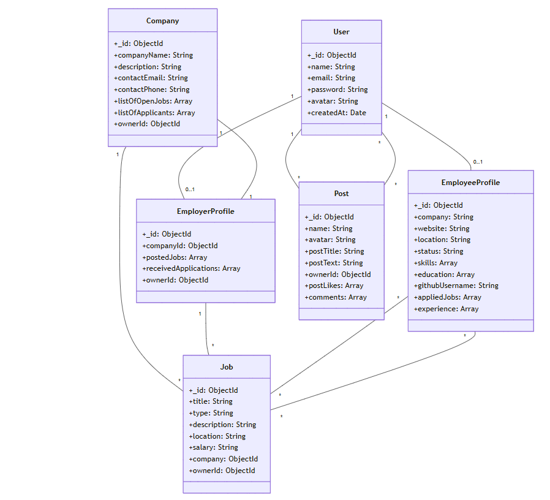

# Dev Job full-stack MERN application

# 1. Project Overview

## Brief Description

This application is a job board platform built to connect employers and job seekers efficiently. It offers a range of features, including:

- **User Authentication** – Secure sign-up and login for both employers and job seekers.
- **Job Postings** – Employers can create, manage, and update job listings.
- **User Profiles** – Job seekers can build and maintain professional profiles.
- **GitHub Integration** – Automatically fetches and displays public GitHub profile information to highlight candidates' coding contributions and activity.

Designed with scalability and ease of use in mind, this platform streamlines the hiring process while providing valuable insights into candidates' technical expertise.

## Main Features/Functionalities

### User Management

- User registration and authentication (Employee/Employer roles)
- Profile creation and management (Employee/Employer)
- GitHub profile integration for developers
- Avatar/profile picture support using Gravatar (Employee/Employer)

### Employees Features

- Create, Read, Update, and Delete professional profiles
- Browse job listings
- Search and filter jobs by various criteria
- GitHub portfolio integration

### Employer Features

- Create, Read, Update, and Delete company profile
- Create, Read, Update, and Delete job listings
- Browse employee profiles
- Search candidate profiles

### Core Platform Features

- Secure authentication using JWT
- Role-based access control
- RESTful API architecture
- Pagination
  - **Request Parameters:**
    - `page` (optional): Page number, defaults to 1
    - `limit` (optional): Items per page, defaults to 10

<details>
   -<summary> **Example Request:**</summary>
   ```http
   GET /api/jobs?page=2&limit=10
   ```
   - <summary>**Response Format:**</summary>
   ```json
   {
      "success": true,
      "data": {
         "items": [...],
         "pagination": {
               "currentPage": 2,
               "totalPages": 5,
               "totalItems": 48,
               "hasNextPage": true,
               "hasPrevPage": true
         }
      }
   }
   ```
<details>

## Technical Stack (MERN)

- MongoDB: NoSQL database for flexible data storage
- Express.js: Backend web application framework
- React: Frontend user interface library
- Node.js: Runtime environment for server-side code

# 2. Project Architecture

This Node.js backend application follows a modular architecture with clear separation of concerns:

- config/ - Contains configuration files for database and routes
- controllers/ - Handles HTTP requests and response logic
- middlewares/ - Contains middleware functions for authentication, session management, and request preprocessing
- models/ - Defines data models and schema
- services/ - Contains business logic and external service integrations
- util/ - Utility functions and helpers

### Directory Structure

```
Devjobs web app/
├── README
├── assets/
│    images/
│       └── relationship-models-dev-jobs.png
├── Rest-api/
|   └── server/
│    ├── config/
│    │   ├── cors.js
│    │   ├── database.js
│    │   └── routes.js
│    │
│    ├── controllers/
│    │   ├── authController.js
│    │   ├── defaultController.js
│    │   ├── employeeProfileController.js
│    │   ├── employerProfileController.js
│    │   ├── jobsController.js
│    │   ├── postsController.js
│    │   └── usersController.js
│    │
│    ├── middlewares/
│    │   ├── errorHandler.js
│    │   ├── guards.js
│    │   ├── paginationMiddleware.js
│    │   ├── preload.js
│    │   ├── session.js
│    │   └── validateBodyRequest.js
│    │
│    ├── models/
│    │   ├── Company.js
│    │   ├── EmployeeProfile.js
│    │   ├── EmployerProfile.js
│    │   ├── Job.js
│    │   ├── Post.js
│    │   └── User.js
│    │
│    ├── services/
│    │   ├── authService.js
│    │   ├── employeeProfileService.js
│    │   ├── employerProfileService.js
│    │   ├── githubService.js
│    │   ├── jobsService.js
│    │   └── postService.js
│    │
│    └── util/
│    │   ├── errorParser.js
│    │   └── formatPaginatedResponse.js
│       
│
├── .gitignore
├── package-lock.json
├── package.json
└── server.js

```

# 3. Database Schema

## Models Overview

Application uses MongoDB with Mongoose and consists of the following main models:

- **User Model**
  Handles user authentication and basic user information

- **Company Model**
  Stores company information for employers

- **Job Model**
  Represents job listings

- **Profile Models**
  - **EmployeeProfile**
    Stores information for employee
  - **EmployerProfile**
    Stores information for employer

### Model Relationships



**Notation**:

- **1**: exactly one
- **0..1**: zero or one (optional)
- *: many (zero or more)

*Relationship Legend*:

   - User-EmployeeProfile (1 : 0..1): One User can have zero or one EmployeeProfile
   - User-EmployerProfile (1 : 0..1): One User can have zero or one EmployerProfile
   - User-Post (1 : *): One User can create many Posts
   - Company-Job (1 : *): One Company can have many Jobs
   - Company-EmployerProfile (1 : 1): One Company belongs to one EmployerProfile
   - Job-EmployeeProfile (* : *): Many Jobs can have many applicants
   - Post-User (* : *): Many Posts can be liked/commented by many Users
   - EmployerProfile-Job (1 : *): One EmployerProfile can post many Jobs
   - EmployeeProfile-Job (* : *): Many EmployeeProfiles can apply to many Jobs


# 4. API Documentation

## Introduction

The Dev-Job API is organized around REST. This API has predictable resource-oriented URLs, accepts form-encoded request bodies, returns JSON-encoded responses, and uses standard HTTP response codes and authentication.
The Dev-Job API doesn’t support bulk updates. You can work on only one object per request.

## URL

All endpoints are prefixed with "/api". Consequently, during the development phase, the endpoints will be accessible via the following URL: "http://localhost:5001/api".

## Methods

`GET` | `POST` | `PUT` | `DELETE`

## URL query parameters

Required: `id=[string]`

## Response

**Code:** `200 OK`\
 Returns the requested data, at the specified page of the results.

**Code:** `204 No Content`\
 Returned if the data property was removed successfully.

**Code:** `400 Bad Request`\
 Returned if the request is invalid.

**Code:** `401 Unauthorized`\
 Returned if the user is not logged in.

**Code:** `403 No Content`\
 Returned if no credentials available.

**Code:** `404 No Found`\
 Returned if the data property does not exist.

**Code:** `500 Internal Server Error`\
 The server encountered an unexpected condition that prevented it from fulfilling the request.

## Links

[API Postman documentation](https://documenter.postman.com/preview/28859516-1a8f94a3-e470-42fd-af26-47f0bd7815b3?environment=&versionTag=latest&apiName=CURRENT&version=latest&documentationLayout=classic-double-column&documentationTheme=light&logo=https%3A%2F%2Fres.cloudinary.com%2Fpostman%2Fimage%2Fupload%2Ft_team_logo%2Fv1%2Fteam%2Fanonymous_team&logoDark=https%3A%2F%2Fres.cloudinary.com%2Fpostman%2Fimage%2Fupload%2Ft_team_logo%2Fv1%2Fteam%2Fanonymous_team&right-sidebar=303030&top-bar=FFFFFF&highlight=FF6C37&right-sidebar-dark=303030&top-bar-dark=212121&highlight-dark=FF6C37)

# 5. Environment Setup

## Prerequisites

- Node.js (v18 or higher)
- MongoDB installed and running locally, or a MongoDB Atlas account

## Installation Steps

1. Clone the repository
   `git clone <repository-url>`
   `cd devjobs-web-app`

2. Install dependencies  
   `npm install`

3. Create Environment Variables
   Create a `.env` file in the root directory and add the following variables:

#### Server Configuration

- PORT=5001
- NODE_ENV=development

#### MongoDB Connection

- MONGODB_URI=mongodb://localhost:27017/devjobs

#### or

- MONGODB_URI=mongodb+srv://@cluster.mongodb.net/devjobs

#### JWT Configuration

- JWT_SECRET=your_jwt_secret_key

#### Optional: GitHub Integration

- GITHUB_CLIENT_ID=your_github_client_id
- GITHUB_CLIENT_SECRET=your_github_client_secret

## Available Scripts

Start the server in production mode:
`npm start`

#### or

Start the server in development mode with nodemon:
`npm run server`

## Dependencies Overview

### Main Dependencies

- `express`: Web framework for Node.js
- `mongoose`: MongoDB object modeling tool
- `jsonwebtoken`: JWT implementation for authentication
- `bcryptjs`: Password hashing
- `dotenv`: Environment variables management
- `express-validator`: Input validation middleware
- `axios`: HTTP client for API requests
- `gravatar`: Profile picture integration
- `cookie-parser`: Cookie parsing middleware

### Development Dependencies

`nodemon`: Development server with auto-reload

## Next Steps

1. Start MongoDB service (must be running before server start)
2. Configure your `.env` file with appropriate values
3. Start the development server with `npm run server`
4. The API will be available at `http://localhost:5001` (or your configured PORT)

# 6. Security Measures

## Authentication

- JWT-based authentication with secure cookie session storage
- Session duration: 1 hour
- Protected routes using middleware guards:
- `hasUser`: Verifies authenticated user
- `isOwner`: Validates resource ownership
- `checkUserRole`: Role-based access control
- Protected auth routes for logged-in users
- CORS configuration for secure client-server communication

# 7. Error Handling

## Validation and Error Types

- Global Error Handling
- Pre-request validation with express-validator middleware
- Model-level Mongoose schema validation
- Consistent error response format
- Production-safe error messages for users

# 8. References & Resources Used
- Express cors middleware
  - Source: [Link](https://expressjs.com/en/resources/middleware/cors.html)
- How to Build Secure and Scalable Authentication System with Node.js and MongoDB
  - Source: [Link](https://sandydev.medium.com/how-to-build-secure-and-scalable-authentication-system-with-node-js-and-mongodb-c50bf51c06b0)
- Build a Login and Logout API using Express.js (Node.js)
   - Source: [Link](https://dev.to/m_josh/build-a-jwt-login-and-logout-system-using-expressjs-nodejs-hd2)
- Simplified Guide to Setting Up a Global Error Handler in Express.js
  - Source: [Link](https://medium.com/@mohsinansari.dev/simplified-guide-to-setting-up-a-global-error-handler-in-express-js-daf8dd640b69)
- Implementing Pagination in an Express.js Application
  - Source: [Link](https://medium.com/@atacanymc/implementing-pagination-in-an-express-js-application-551244b62d48)
- Software documentation guide
   - Source: [Link](https://www.writethedocs.org/guide/index.html)  
- How To Build an ER Diagram with Mermaid Chart
   - Source: [Link](https://docs.mermaidchart.com/blog/posts/how-to-build-an-er-diagram-with-mermaid-chart)